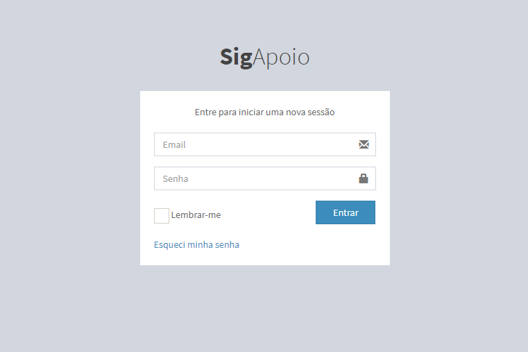

# SigApoio
> Sistema de Gestão de Apoio Pedagógico

_________________

> - Este sistema tem como objetivo controlar a demanda (Empréstimo, Agendamento) de um setor setorial de uma instituição que é responsável por este serviço.
> - Este sistema tem como objetivo controlar uma demanda (Empréstimo de itens , Agendamento de itens e espaços fisicos ) de um setor de uma instituição de crédito que é responsável por este serviço.
> - Sistema de cunho acadêmico como projeto da 3ª etapa da programação da Web

## Recursos Utilizados

- Para front-end foi utilizado Framework Bootstrap com templat AdminLTE
- Para back-end foi utilizado Framework Laravel 5.5
- Para o banco de dados foi utilizado o SGBD MySQL



## Instalação
#### Pré-requisitos
- Ter PHP 7 (path do S.O): [Tutorial Aqui!](https://thishosting.rocks/install-php-on-ubuntu/)
- Ter MySQL
- Ter Composer: [Tutorial Aqui!](https://www.digitalocean.com/community/tutorials/como-instalar-e-usar-o-composer-no-ubuntu-18-04-pt)
- Clonar o repositório
#### Comandos via Terminal (Dentro do diretório do projeto já Clonado)

Instale as dependências e o framework:
```sh 
composer install --no-scripts
```

Copie o arquivo .env.example: (Comando cp para terminal bash(linux)) 
```sh
cp .env.example .env
```

Crie uma nova chave para a aplicação: 
```sh
php artisan key:generate
```

#### Configurar o .env
    DB_CONNECTION=mysql
    DB_HOST=127.0.0.1
    DB_PORT=3306
    DB_DATABASE=sig_apoio_laravel
    DB_USERNAME= SeuUsuarioSGBD
    DB_PASSWORD= SuaSenhaSGBD
#### Novamente via Terminal

Rodar as migratios: 
```sh
php artisan migrate --seed
```

## Login no Sistema
- > O sistema já vem com um usuário cadastrado.

- >Email: gerson10caicorn@hotmail.com
Senha: 123

Fim!